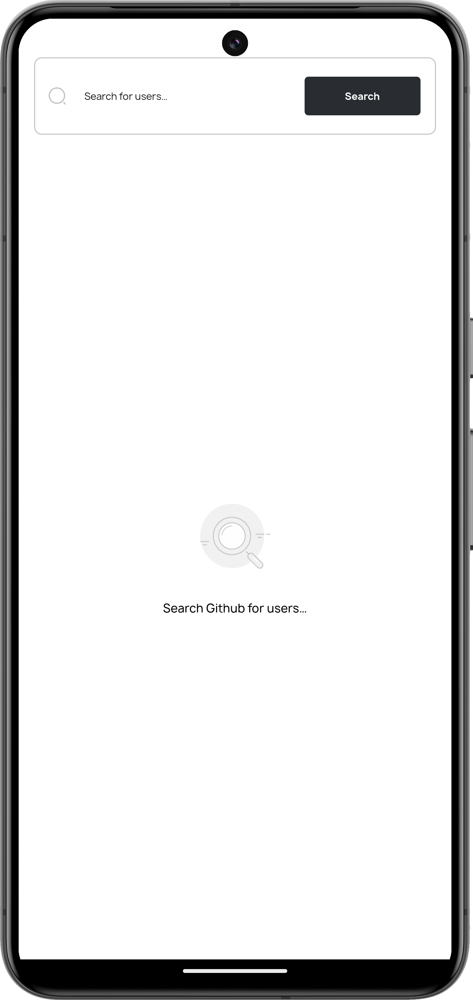
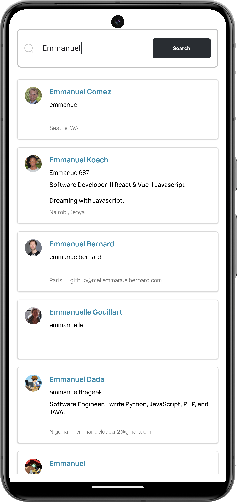
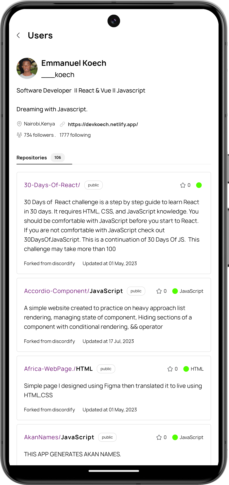
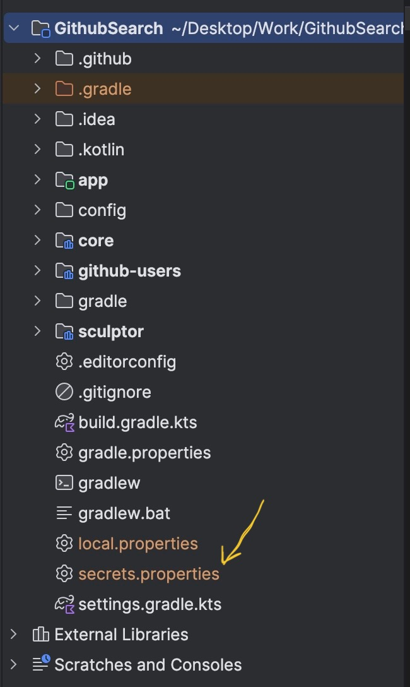
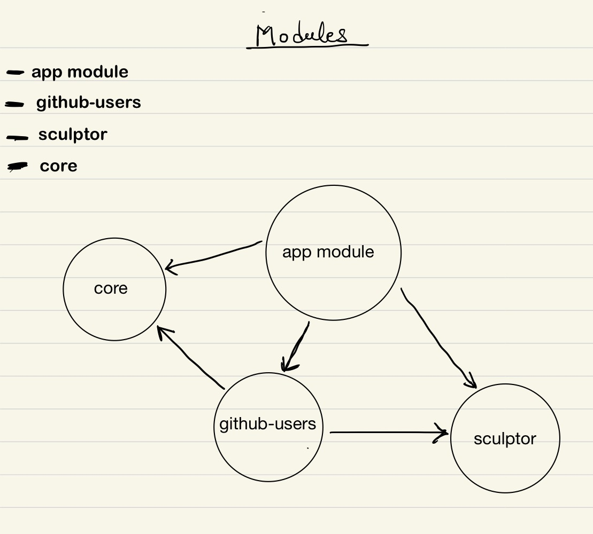

# GitHub users search

This is an application that allows us to search for users on GitHub, it uses GitHub REST [API](https://docs.github.com/en/rest/search/search?apiVersion=2022-11-28#search-users) 

It aims to showcase some modern techniques used in building Android applications.

{ width=100 height=200 }

{ width=100 height=200 }

{ width=100 height=200 }

## Application setup

- Clone the project from GitHub.
- Create your GitHub personal access token, follow [this](https://docs.github.com/en/authentication/keeping-your-account-and-data-secure/managing-your-personal-access-tokens) guide to create one

- In the root folder, create a [secrets.properties](http://secrets.properties) file and add the following line of code.
    
    ```
    SECRET_GITHUB_TOKEN=<Inset your github personal access token here>
    ```
    
- Run the project 😃



## Project Architecture.

The project uses multiple modules, each feature is separated into modules. 



**core**: Contains shared logic, code, and resources used across different modules.

**sculptor**: Contains core design components implementations such as texts, buttons, cards, navigation bars, etc.., fonts, color tokens, and spacing. This ensures that it matches design specifications and ensures consistency of design elements across the app. 

**github-users**: Contains UI, business logic, and presentation architecture for searching users’ functionality. 

**app**: This is the runnable module, it integrates resources and code from all “feature” modules, APK can be created from this module. 

### Continuous Integration

This is done using GitHub Actions, for now, all it does is: 

- Clean the project.
- Create a new build.

For Further  improvements, we can add the following: 

- Adding Android unit tests.
- Code quality checks(using detekt and ktlint).
- Build deployment.

## Code Quality

To ensure consistent formatting and code style **ktlint** and **detekt are used.**

Detekt → This performs static code analysis and ensures that a standard style is maintained across the project. 

Ktlint → This mostly help with code formatting and linting.  

## Notable Libraries

1. **Retrofit**, **Okhttp** and **Gson** → These are used for making network requests as well as serialising and deserialising the JSON received. 
2. **Coil** → Image loading 
3. **Junit5** → To run unit tests 
4. **Mockk** → Used to mock test objects. 
5. **Mockwebserver** → Receive mock network responses. 

## Possible Improvements

- Integrate ktlint and detekt gradle tasks to the pre-commit hook to ensure every commit is well formatted and follows the right code styles.
- Write UI integration tests

### UI Architecture

Since each product feature is abstracted into its module, every feature can use any UI arch that works best for the intended work. 

For now, we only have the **github-users** module for searching GitHub users, **MVI** architecture is used here. More information can be found in the documentation in the module’s root.